# Lunar Return Rendezvous

A crew lifts off from the Moon. Their ascent stage reaches a 100 km circular orbit with the
dispersion that a single-string engine and a shifting centre of mass always leave behind. Their
mothership is 300 km higher and ten degrees ahead. Nobody is coming to help.

This repository is my end-to-end MATLAB simulation of what happens next: the phasing wait, the
Hohmann climb, the proximity operations that buy back the injection error, the perturbations that
pull the meeting point apart, a three-body re-check of the whole manoeuvre, and the five-joint arm
that finally grabs the vehicle. Everything is written from first principles — `ode45` and
`fminsearch` are the only solvers used, and no MathWorks toolbox beyond base MATLAB is required.

## Watch

[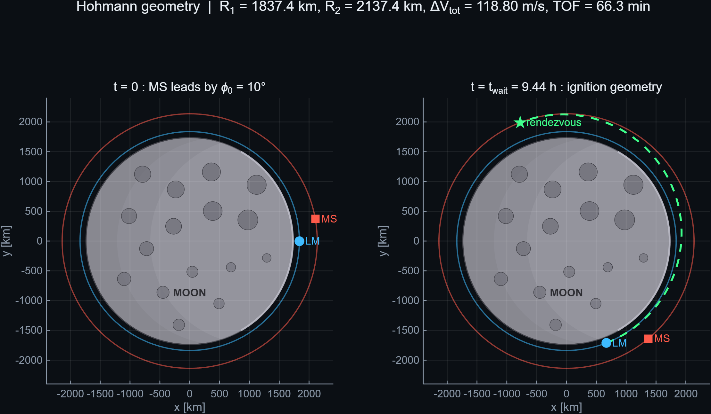](results/video/showreel.mp4)

**[▶ results/video/showreel.mp4](results/video/showreel.mp4)** — 89 seconds, silent, 1920×1080,
x264 CRF 17. A square 1080×1080 cut for social feeds sits beside it as `showreel_square.mp4`, and
the individual clips are in `results/video/clips/`.

**[📄 29-page technical report (PDF)](results/report/Lunar_Return_Rendezvous_Report.pdf)** —
the same work written up as a paper, with derivations, verification sections and an honest
limitations chapter. A [one-page French summary](docs/resume_fr.md) is also available.

| | | |
|---|---|---|
| 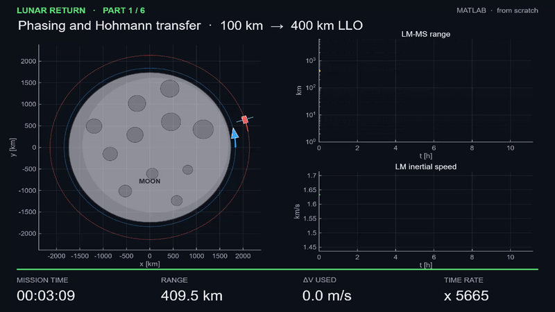 | 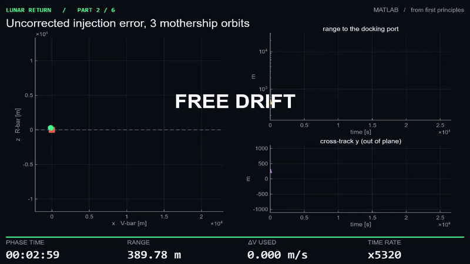 | 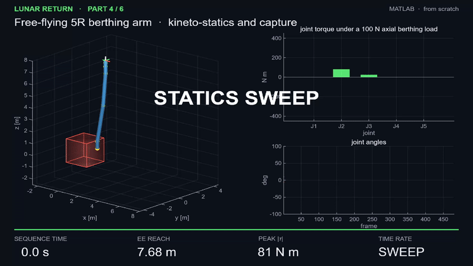 |
| Phasing and Hohmann climb | 50 m hold, then V-bar docking | 5R berthing arm |

---

## Key numbers

| | |
|---|---|
| Total Δv, orbital phase | **118.80 m/s** |
| Phasing wait before ignition | **9.44 h** (transfer itself: 66 min) |
| Numerical vs closed-form Kepler | **0.19 mm** over 10.5 h |
| Injection error → uncorrected drift | 529 m → **21.0 km** in three orbits |
| Hold acquisition + docking Δv | **1.12 + 0.16 m/s** |
| J2 miss without retargeting | **15.1 km** |
| Earth third-body contribution | **116 m** |
| CR3BP correction to the two-body design | **8.8 mm/s** |
| Arm reach / peak joint torque at 100 N | **7.7 m** / **396 N·m** |
| Inverse kinematics residual | **0.99 mm** in 18 iterations |

The most instructive result is not a Δv. It is the ratio of timescales: the transfer lasts
66 minutes, waiting for the phasing window takes 9.4 hours. On a rendezvous of this kind propellant
is cheap and patience is the constraint.

---

## Verification

Every headline number is re-derived independently, either in closed form from the raw constants or
against a separate implementation of the same mission geometry. `tests/audit_reference.m` replays
all of it at the end of every build and writes
[`results/AUDIT_REPORT.md`](results/AUDIT_REPORT.md). Current status: **60 PASS, 1 WARN, 0 FAIL**.

- **Hohmann design** — all thirteen scalars (Δv, a, e, TOF, period, lead angle, phasing wait) match
  the closed-form re-derivation to better than 3×10⁻⁴ relative. PASS.
- **Kepler integration** — `ode45` at 1e-12 tolerances differs from the analytical solution by
  0.19 mm over the full timeline, against a 1 mm acceptance bound. PASS.
- **Constants of motion** — energy, angular momentum and eccentricity plateaus match
  −μ/2a and √(μa(1−e²)) to 10⁻¹². PASS.
- **HCW state transition matrix** — Φ(0) = I exactly; dΦ/dt(0) reproduces the system matrix to
  2×10⁻¹⁶, which is what actually pins the Coriolis signs; Φ(t)Φ(−t) = I. PASS.
- **Frame convention** — settled empirically, not asserted. Fed an independent implementation's
  injection error, our targeting returns 1.419 m/s against its 1.4 m/s; the mirrored convention
  returns 1.277 and does not reproduce it. PASS.
- **Docking Δv** — 0.15673 against an independent 0.1567 m/s, a 0.02 % match on an
  almost geometry-only quantity. PASS.
- **Third-body contribution** — 115.7 m against 116.0 m. This tests the indirect term in Battin's
  difference form, which is the easy thing to drop. PASS.
- **J2 miss** — 15.14 km against 14.56 km, +4 %. Same order; the four candidate causes were checked
  in source and none is at fault. Documented as sensitivity, not tuned. PASS.
- **CR3BP** — shooting converges to 4.8×10⁻⁸ m and the Jacobi constant, an exact invariant, drifts
  by 9×10⁻¹³ relative. The Δv correction of 8.8 mm/s against a reference optimiser's 1.5 mm/s is
  the single **WARN**: same order, explained as an optimiser artefact of a rank-deficient shooting
  problem. PASS / WARN.
- **Kineto-statics** — the base reaction force equals the applied force to 2×10⁻¹⁴ N, and the
  36×11 twist-propagation route agrees with the 6×5 Jacobian route to 1×10⁻¹³ N·m. Two independent
  pieces of algebra, machine precision. PASS.

Seven fast unit tests (`run_unit_tests`) cover the same ground in under a second for use before a
commit.

---

## Physics modules

**1 · Orbital transfer** — Tangential Hohmann transfer plus the phasing analysis that decides when
to light the engine. The required lead angle at ignition is 18.61°, the mothership only leads by
10°, so the window has just been missed and the chaser waits 9.44 hours for a full relative
revolution. The timeline is then propagated twice, numerically and in closed form through Kepler's
equation, and differenced.

**2 · Proximity operations** — A random injection error is propagated with the Hill–Clohessy–Wiltshire
state transition matrix. Left alone it becomes a 21 km drift in three orbits. A two-impulse transfer
buys the 50 m V-bar hold, and a five-leg forced straight-line approach walks the vehicle into the
port. The linear model is then checked against the exact nonlinear relative equations: they part
company by about 100 m after three orbits at kilometre range, and by well under a millimetre at the
hold point, where ρ/R₂ ≈ 2×10⁻⁵.

**3 · Perturbations** — The same plan flown against a Cowell model with lunar J2 and the Earth as a
third body, deliberately **without retargeting**. Sized as an impulse, removing the resulting miss
costs roughly n₂·|miss| ≈ 10.7 m/s — the mid-course correction budget a real flight plan carries.

**4 · Berthing manipulator** — A five-revolute arm on a free-flying base: Grübler mobility, cylinder
inertias, homogeneous-transform forward kinematics, and the 36×11 twist-propagation matrix **N**.
Kineto-static duality τ = Nᵀw then gives joint torques and base reaction for three postures under
two berthing wrenches. Folding the arm raises the shoulder load fivefold for an identical applied
force: actuator sizing is driven by posture, not by load magnitude.

**5 · CR3BP verification** — The transfer re-converged by single shooting on [δvₓ, δv_y, TOF] in the
Earth–Moon synodic frame. The honest answer to "does the Earth matter here?": not much, and now it
is quantified rather than assumed.

**6 · Inverse kinematics** — A 5R arm cannot serve all six task degrees of freedom, so the solver
says so out loud: weighted damped least squares with W = diag(1,1,1,1,1,0.01) spends the redundancy
on position and accepts an attitude residual. The capture is flown as a rest-to-rest cubic over 30 s.

---

## How to run

```matlab
>> run_all          % or: build_all
```

Roughly twelve minutes on a laptop: about one minute of physics, the rest rendering video and
running the audit. From a shell:

```bash
matlab -batch "run_all"
```

A note on the entry point. MATLAB identifiers may not start with a digit, so a file named
`00_main.m` cannot be executed — not as `00_main`, and not through `run('00_main.m')` either; both
fail with *Invalid text character* before a line is parsed. `00_main.m` is kept as the documented
entry point and says exactly this in its header; the orchestration lives in `build_all.m`, and
`run_all` is the one-word alias to type.

Headless Linux needs a framebuffer for the video stage:

```bash
xvfb-run -a matlab -batch "run_all"
```

Useful switches in `config/mission_constants.m`: `C.makeVideo` (figures only when false),
`C.skipAudit`, `C.videoCRF`, `C.videoRes`.

Unit tests, under a second:

```matlab
>> run_unit_tests
```

Rebuilding the PDF report needs a LaTeX installation:

```bash
cd docs/report && latexmk -pdf main.tex
```

Every number in the report is injected from `docs/report/metrics.tex`, which MATLAB regenerates from
the simulation output, so the document cannot quote a value the code has stopped producing. If
MATLAB cannot reach `ffmpeg`, the clips are still written and the reel can be assembled by hand with
`./tools/concat_showreel.sh`.

Outputs land in `results/`: 20 PNG figures, eight MP4 clips (the seven that make up the reel plus a
supplementary telemetry clip), the reel itself, the PDF report, `metrics.mat`, `metrics.json`,
`AUDIT_REPORT.md` and `BUILD_REPORT.md`.

---

## Results gallery

| | |
|---|---|
|  | 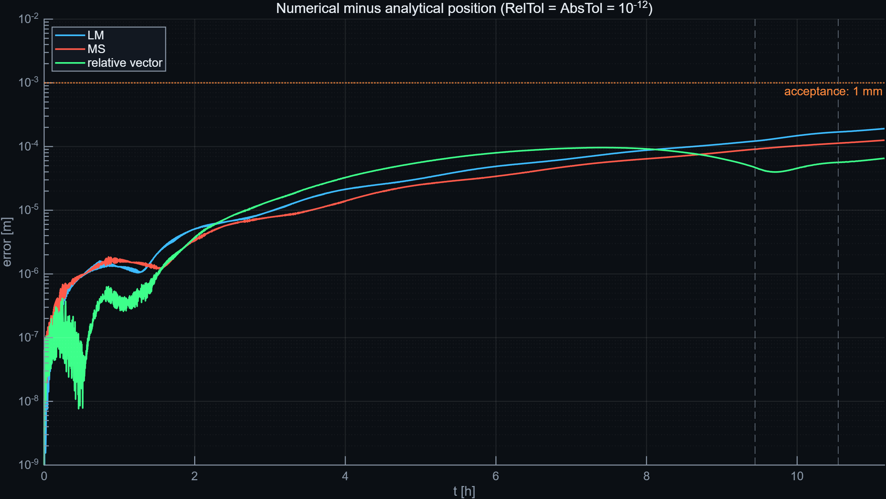 |
| Hohmann geometry at t = 0 and at ignition | Numerical minus analytical, over ten hours |
| 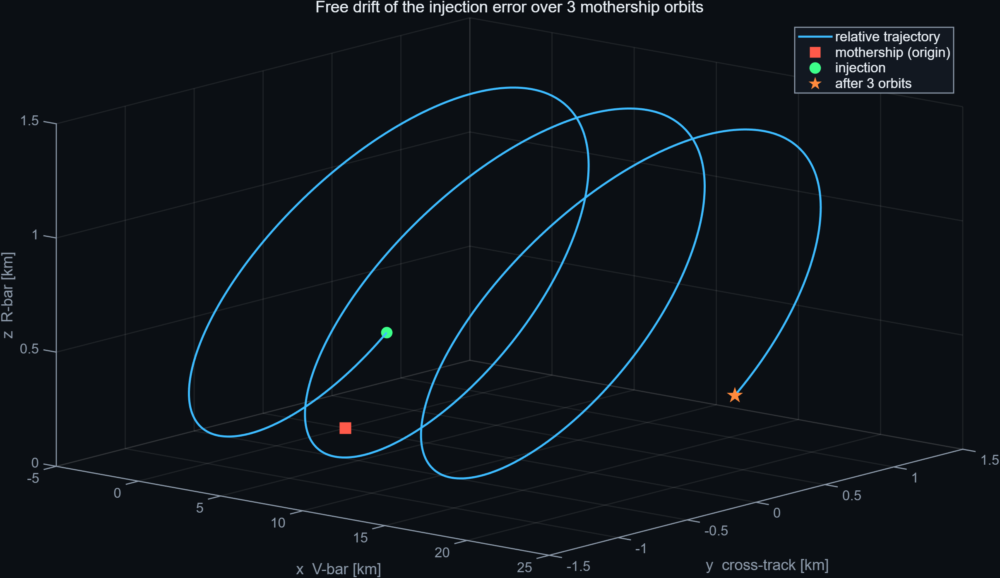 | 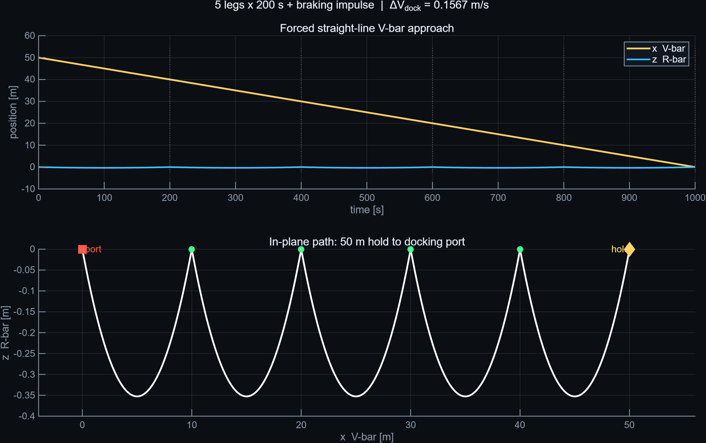 |
| Free drift of the injection error | Forced V-bar approach to the port |
| 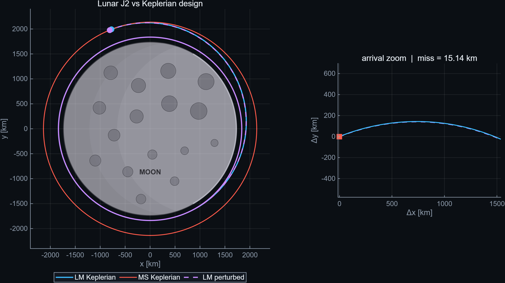 | 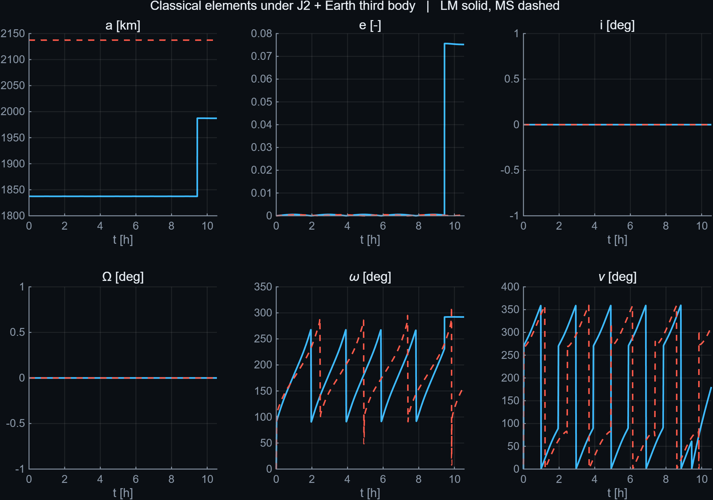 |
| J2 against the Keplerian design | Classical elements under J2 + third body |
| 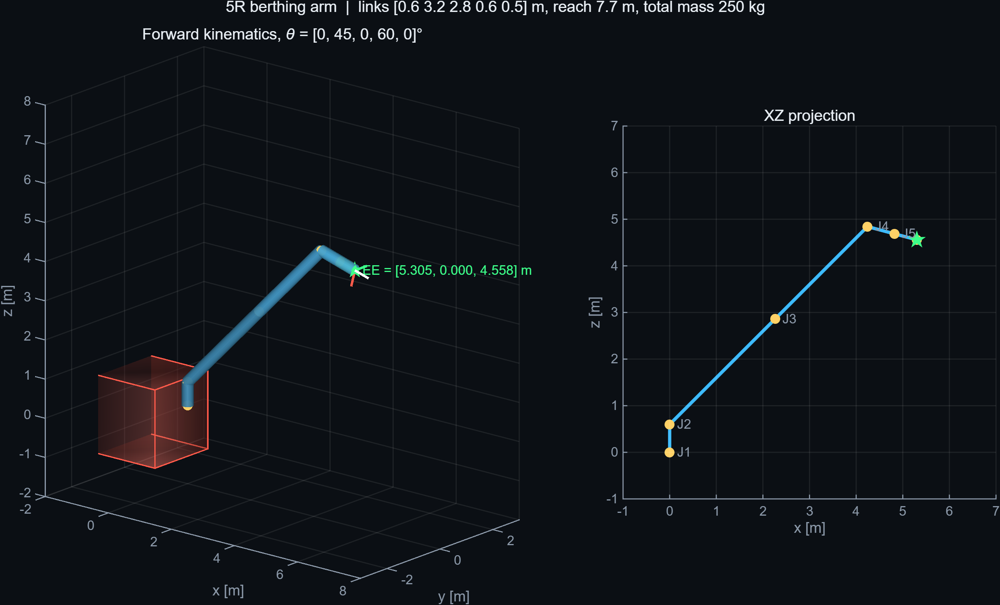 | 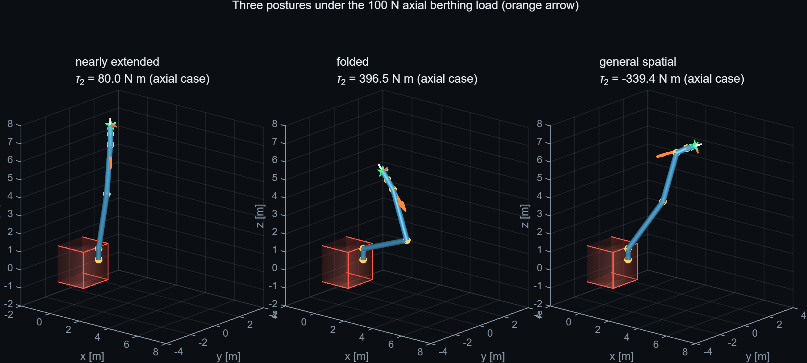 |
| Forward kinematics verification pose | Three postures under the berthing load |
| 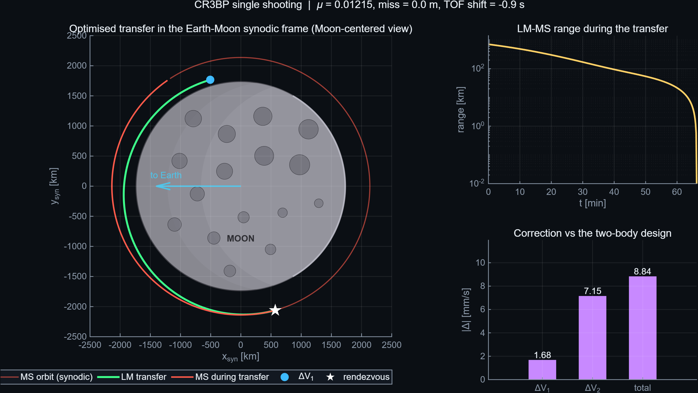 | 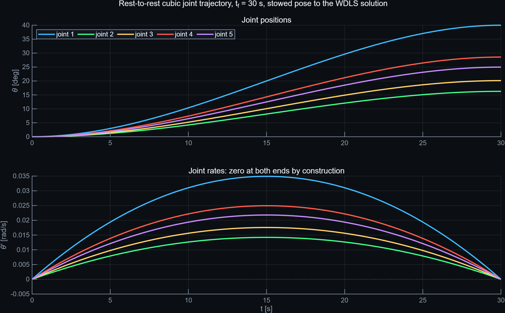 |
| CR3BP transfer in the synodic frame | Rest-to-rest cubic joint trajectory |

`fig01` through `fig20` are in `results/figures/` in the dark theme used here, and in
`docs/report/figs/` in a 300 dpi academic theme used by the PDF.

---

## Repository layout

```
build_all.m               orchestrator: physics, figures, video, audit, reports
run_all.m                 alias, the thing to type
00_main.m                 documented entry point (see the note above)
config/mission_constants.m  every physical constant, in one struct
lib/astro/                two-body, J2, third body, Kepler, elements, Hohmann, phasing
lib/relative/             HCW state transition matrix, targeting, nonlinear relative EOM
lib/cr3bp/                synodic equations of motion, frame conversions, shooting
lib/robot/                kinematics, twist propagation, wrenches, WDLS, trajectories
lib/util/                 metrics serialisation, LaTeX macro generation
parts/                    the six studies, each one figure-producing script
viz/                      themes, scene primitives, HUD, encoder, eight animations
tests/                    the reference audit plus seven fast unit tests
docs/report/              LaTeX sources for the PDF
tools/concat_showreel.sh  standalone reel assembly
results/                  figures, video, report, metrics, audit and build reports
```

Every part saves its time histories to `results/traj_partN.mat`, and the animations load those files
and nothing else. A failed encoder therefore cannot invalidate the science, and re-cutting the video
never re-runs an integrator.

---

## Method, if you want to reuse it

The pattern that makes this repository worth reading is not the orbital mechanics, which is
textbook. It is the verification discipline, and it transfers to any simulation:

1. **Put every physical constant in one struct** and treat a literal anywhere else as a bug.
2. **Solve each problem twice** where a closed form exists, and difference the two. The 0.19 mm
   Kepler check is what licenses the 15 km J2 result.
3. **Monitor invariants the dynamics cannot violate** — energy, angular momentum, the Jacobi
   constant — because they catch integrator problems that no plot reveals.
4. **Derive the same quantity by two different routes.** The joint torques are computed once through
   a 36×11 twist-propagation matrix and once through a 6×5 Jacobian; agreement to 10⁻¹³ is worth
   more than either result looking plausible.
5. **Pin conventions with a test, not a comment.** The LVLH handedness here was settled by
   reproducing an independent implementation's Δv, and the comment now records the evidence.
6. **Separate the science from the presentation.** Physics writes MAT-files; animation reads them.
   Neither can break the other.
7. **Report what disagrees.** The audit table carries a WARN and a +4 % discrepancy with
   explanations rather than a clean sheet.

---

## Limitations

I would rather list these than let a reader discover them. The report expands on each.

- **Equatorial and coplanar only.** No inclination change, no relative RAAN, so the out-of-plane
  budget that dominates real rendezvous planning never appears. The largest single omission.
- **Gravity stops at J2.** No mascons, no C22 ellipticity. Low lunar orbits are genuinely unstable
  under the real field over weeks; nothing here runs that long, but the frozen-orbit design a real
  mission would use is out of scope.
- **No solar radiation pressure integration.** Estimated at ~10⁻⁷ m/s² and excluded, with reasoning.
- **Impulsive burns.** No finite-burn losses, throttle profiles, slosh or attitude slews.
- **Circular target orbit, not a halo.** A realistic Artemis-era architecture uses an NRHO, where
  phasing is a qualitatively different problem.
- **The arm is kinematic and static.** No joint flexibility, no contact dynamics, no free-floating
  momentum coupling. The LVLH frame is treated as inertial during berthing.
- **One random draw.** The injection error is a single realisation of seed 42, not a Monte Carlo,
  so the proximity Δv figures are one sample rather than a distribution.

---

## References

Public textbooks and papers only.

- H. D. Curtis, *Orbital Mechanics for Engineering Students*, 4th ed.
- D. A. Vallado, *Fundamentals of Astrodynamics and Applications*, 4th ed.
- W. Fehse, *Automated Rendezvous and Docking of Spacecraft*
- W. H. Clohessy and R. S. Wiltshire, "Terminal Guidance System for Satellite Rendezvous",
  *Journal of the Aerospace Sciences*, 1960
- B. Siciliano, L. Sciavicco, L. Villani, G. Oriolo, *Robotics: Modelling, Planning and Control*
- R. H. Battin, *An Introduction to the Mathematics and Methods of Astrodynamics*
- V. Szebehely, *Theory of Orbits: The Restricted Problem of Three Bodies*
- M. T. Zuber et al., "Gravity Field of the Moon from GRAIL", *Science* 339, 2013

## License

MIT — see [LICENSE](LICENSE).
