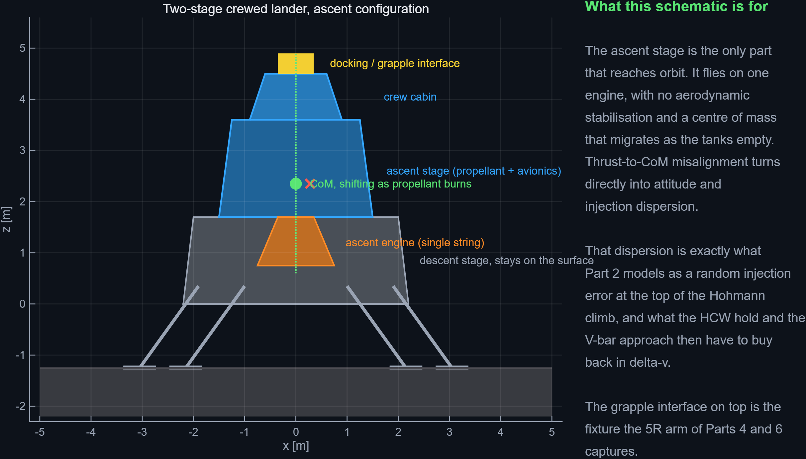

# Crewed lunar landers and why the ascent is the hard part

*Figure 18, generated by `viz/make_lander_schematic.m`. No photograph is used anywhere in this
repository; the diagram is drawn from patches so it can be shared without a licensing question.*

---

## Two vehicles worth studying

**Apollo Lunar Module (Grumman, six landings 1969–1972).** Two crew, two stages. The descent stage
carried the throttleable descent engine, the landing gear, consumables and the surface payload; it
stayed on the Moon and doubled as the launch pad for the ascent stage. The ascent stage was the crew
cabin plus a single fixed-thrust engine, and it was the only part that ever went back to orbit. The
architecture was chosen because it is the cheapest way to leave mass behind: every kilogram of
landing hardware that does not have to be re-accelerated to 1.6 km/s is a kilogram that does not have
to be carried from Earth in the first place. That logic has not changed, and it is the same logic
that makes the minimum-energy Hohmann transfer in Part 1 the right first answer rather than a
textbook simplification.

**Altair (Constellation, cancelled 2010).** The four-crew successor concept. It was substantially
larger — a descent stage sized for a global-access mission with a liquid-oxygen/liquid-hydrogen
engine, an airlock, and the ability to land cargo uncrewed. Altair never flew and the programme was
cancelled, but the design work did not evaporate: the requirement set it produced — four crew, global
surface access, an uncrewed cargo variant, extended surface duration, and rendezvous with a vehicle
in a lunar orbit rather than in low Earth orbit — is recognisably the ancestor of the Artemis Human
Landing System requirements. The architectural idea this simulation borrows from Altair is precisely
the one Apollo did not have: the lander's partner is not necessarily in a low circular orbit at a
convenient phase angle, and the return leg is a rendezvous problem in its own right rather than an
afterthought.

## Why ascent, specifically, is where the dispersion comes from

Descent is hard in the sense that it is unforgiving: you get one attempt, the terrain is uncertain,
and the fuel margin is thin. But ascent is hard in a different and more relevant way for this
project. It is the phase that *injects errors into an orbit*, and those errors are what proximity
operations have to pay for later.

**Single-string propulsion.** The Apollo ascent engine had no backup and no throttle. A crewed
lander's ascent engine is typically fixed-thrust for exactly the reason it is single-string: fewer
moving parts, fewer failure modes, and an engine that cannot be shut down and restarted is an engine
that cannot fail to restart. The consequence is that the burn is open-loop in magnitude. Guidance can
steer the thrust vector and it can decide when to stop, but it cannot trim the acceleration profile,
so any mismatch between predicted and actual performance shows up directly as a velocity error at
cut-off.

**No aerodynamic stabilisation.** There is no atmosphere, so there is no restoring moment and no
passive damping of any kind. A terrestrial launch vehicle that is slightly misaligned gets pushed
back, or at least gets a predictable aerodynamic moment to fight. A lunar ascent stage that is
slightly misaligned simply keeps rotating until the reaction control system stops it. Attitude
control is 100 % active, 100 % of the time, and every correction is propellant.

**A centre of mass that moves.** The ascent stage burns a large fraction of its own mass in a few
minutes. The centre of mass migrates as the tanks drain, and it does not migrate symmetrically:
propellant and oxidiser tanks are rarely co-located, and they empty at different volumetric rates.
The thrust vector is fixed to the structure. The moment arm between the thrust line and the centre of
mass therefore changes continuously through the burn, producing a slowly varying disturbance torque
that the control system has to track rather than merely reject.

**Thrust-to-CoM alignment.** Even a small static offset matters. A one-centimetre lateral offset on a
15 kN engine is a 150 N·m torque acting for the whole burn. The reaction control system can trim it,
but the trim itself is a lateral impulse that is not aligned with the intended velocity change, and
what it leaves behind is exactly a small velocity error transverse to the target direction.

**Flexible structure and control interaction.** The ascent stage is a light pressure vessel on top of
a thrusting engine, with propellant free to slosh. Structural bending modes and slosh modes sit at
frequencies the attitude controller can excite if its bandwidth is not carefully separated from them.
The classic failure mode is not a dramatic one: the loop stays stable but the pointing jitters, and
the jitter integrates into an attitude error at cut-off.

**Asymmetric inertia.** The cabin, the tanks and the engine are not arranged in a symmetric body. The
inertia tensor has significant off-diagonal terms, so a rotation commanded about one axis produces
coupled rates about the others. Small commanded manoeuvres therefore need more control authority than
a naive diagonal-inertia sizing suggests.

## How this maps onto the simulation

The mapping is deliberate and it is the reason Part 2 exists in the form it does.

**The injection error *is* the ascent GNC and propulsion dispersion.** In `part2_proximity.m` the
chaser arrives at the top of the Hohmann climb with a random position and velocity offset — a few
hundred metres and a fraction of a metre per second, drawn from seed 42. That is not an arbitrary
perturbation added for interest. It is the lumped consequence of everything above: cut-off timing,
thrust misalignment, attitude error at cut-off, and residual reaction-control impulse. Nothing else
in the simulation models the ascent, and nothing else needs to: from orbit, an ascent stage is fully
described by the state it delivers.

**The consequences are then priced.** Left alone, that error becomes a 21 km separation in three
orbits. Removing it costs 1.12 m/s to reach a 50 m hold and 0.16 m/s to close from there. Against a
118.8 m/s transfer budget, the proximity phase is about 1 % — which is the real engineering answer to
"how much does ascent dispersion cost?" and it is only obtainable by modelling both phases in the
same set of units.

**The Hohmann argument survives contact with reality.** The minimum-energy two-impulse transfer is
not a classroom idealisation that real vehicles abandon; it is the reason lunar architectures look
the way they do. What real vehicles add is margin — the mid-course correction that Part 3 sizes at
about 10.7 m/s once J2 is admitted into the model, and the rendezvous sensor-driven corrections that
Part 2's two-impulse targeting stands in for.

**The grapple fixture closes the loop.** The interface drawn at the top of the ascent stage in
Figure 18 is the fixture the 5R arm of Parts 4 and 6 captures. The 100 N axial berthing load used in
the kineto-static study is the scale of contact force a soft-capture mechanism is designed around,
and the 396 N·m shoulder torque it produces in the folded posture is the number that would size the
joint actuators.

## What this survey deliberately does not claim

This is a survey written to frame a simulation, not a historical account. Mass figures, engine
performance and programme dates are not reproduced here, because the simulation does not use them —
it uses one ascent stage delivered to a 100 km orbit with a dispersion, and that is the entire
interface. Anyone wanting the numbers should go to the Apollo Lunar Module Ascent Propulsion System
literature and the Constellation programme documentation directly.
